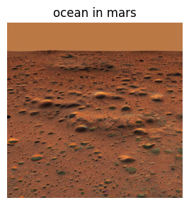
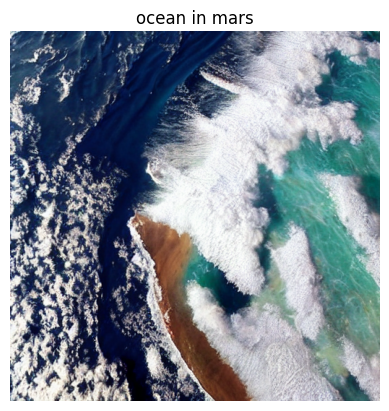

# Fine-Tune Stable Diffusion Model

This project fine-tunes a Stable Diffusion Model using a custom dataset of image-caption pairs. It employs pre-trained Variational Autoencoder (VAE) and U-Net backbones for efficient diffusion in the latent space and fine-tunes a CLIP model for enhanced text-to-image alignment.
Features

    1.Uses VAE to encode and decode images in a compressed latent space.
    2.Leverages a U-Net architecture for modeling noise and progressive denoising.
    3.Fine-tunes CLIP for domain-specific text-image alignment.
    4.Saves the fine-tuned model and processor for future use.
    

